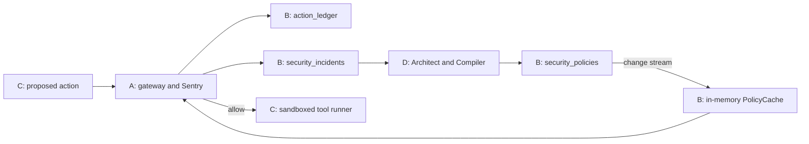

**Person B handoff — Atlas, shared schemas, and the live policy cache**

This document records the work completed for Person B in Immune Harness and the
integration work expected next from Persons A, C, and D. The original project
scope is in [ARCHITECTURE.md](ARCHITECTURE.md); setup commands and additional code
examples are in [README.md](README.md).

B's implementation has been tested locally and against the configured live
MongoDB Atlas database, `immune_harness`. The live demonstration successfully
loaded baseline policies, received a new policy, replaced it with a newer version
without restarting, and removed it from the active cache after retirement.

**B's responsibility is the storage and policy-distribution layer.** A evaluates
actions using the policies B supplies. C submits proposed actions and executes
allowed tools. D learns from incidents, validates candidate policies, and writes
new policy versions into Atlas. The complete detection and enforcement loop still
needs those components connected.



**Files delivered**

| File | What it provides |
| --- | --- |
| [db/schemas.py](db/schemas.py) | Shared Pydantic models, validation, and JSON/BSON serialization helpers |
| [db/atlas.py](db/atlas.py) | Configuration, PyMongo client, collection handles, indexes, baseline seeding, and setup CLI |
| [harness/policy_cache.py](harness/policy_cache.py) | Initial policy loading, background change stream, immutable snapshots, expiry checks, and recovery |
| [scripts/live_demo.py](scripts/live_demo.py) | Visible demonstration using the database configured in `.env` |
| [scripts/run_local_integration.py](scripts/run_local_integration.py) | Isolated local replica set for integration testing or a local demonstration |
| [tests/test_schemas.py](tests/test_schemas.py) | Model validation and JSON/BSON round-trip tests |
| [tests/test_atlas.py](tests/test_atlas.py) | Client configuration, indexes, settings, and repeatable seeding tests |
| [tests/test_policy_cache.py](tests/test_policy_cache.py) | Cache updates, expiry, version selection, failure, recovery, and lifecycle tests |
| [tests/test_integration.py](tests/test_integration.py) | Real MongoDB bootstrap, persistence, transactions, and change-stream test |
| [pyproject.toml](pyproject.toml) | Python package, runtime/development dependencies, CLI entry point, and check configuration |
| [.env.example](.env.example) | Connection and retention configuration template |
| [.gitignore](.gitignore) | Excludes credentials, the virtual environment, and generated development files |
| [README.md](README.md) | Installation, contracts, integration examples, and verification commands |
| [ARCHITECTURE.md](ARCHITECTURE.md) | Preserved copy of the architecture supplied for the project |

Python 3.11+ is required. Runtime dependencies are Pydantic 2, PyMongo,
dnspython for SRV connection strings, and python-dotenv. The development
environment includes pytest and Ruff. A local `.venv` was created and dependencies
were installed. The local `.env` was created with owner-only permissions, and the
user supplied the Atlas URI. Credentials are not included in this handoff.

**How `db/atlas.py` works**

`AtlasSettings.from_env()` reads the project-root `.env`, with existing environment
variables taking precedence. It validates the connection scheme, database name,
retention range, and timeout setting before constructing the client.

| Setting | Purpose | Default |
| --- | --- | --- |
| `MONGODB_URI` | MongoDB connection URI, including database credentials | Required |
| `MONGODB_DB` | Application database | `immune_harness` |
| `LEDGER_TTL_SECONDS` | Ledger retention measured from each row's `ts` | `604800` seconds / 7 days |
| `MONGODB_TIMEOUT_MS` | Server selection, connection, socket, pool wait, and write-concern timeout settings | `5000` ms |

B uses database credentials in a MongoDB URI. An Atlas Administration API key or
LLM API key is not required by these modules. The user configured the cloud
connection; our bootstrap creates application collections and indexes within
that database. It does not provision an Atlas account or cluster.

`Atlas()` creates a reusable synchronous PyMongo client and exposes
`atlas.security_policies`, `atlas.action_ledger`, and `atlas.security_incidents`.
Dates are decoded with timezone information. Database reads and writes use
majority read/write concern. The client enables retryable writes and bounded
timeouts. Importing the module alone does not create a connection.

`Atlas.bootstrap()` performs three operations in order:

1. Ping MongoDB to verify connectivity.
2. Create the indexes, which also creates missing collections.
3. Insert the baseline policies if their policy IDs do not already exist.

Seeding uses `$setOnInsert` with an upsert. Existing baseline versions, statuses,
and content are preserved. Consequently, `0 baseline policies seeded` on a later
run is expected; it means no new baseline documents were needed.

`Atlas.close()` releases the client. A `with Atlas() as atlas:` block closes it
automatically on exit. The CLI also provides a read-only `check` command that
pings MongoDB and opens a policy change stream to verify support and access.

**Collections and indexes created**

`security_policies` stores policy documents and their versions. `action_ledger`
stores every proposed action with its decision. `security_incidents` stores
blocked actions and the information D needs to produce a policy.

| Collection | Index name | Keys | Behavior or purpose |
| --- | --- | --- | --- |
| `security_policies` | `policy_version_unique` | `policy_id: 1, version: 1` | Unique pair; rejects duplicate versions of the same policy |
| `security_policies` | `policy_status` | `status: 1` | Supports loading active policies |
| `security_policies` | `policy_expiry` | `expires_at: 1` | TTL with `expireAfterSeconds=0`; eligible for deletion at the stored deadline |
| `action_ledger` | `action_id_unique` | `action_id: 1` | Rejects duplicate action IDs |
| `action_ledger` | `target_recent` | `target: 1, ts: -1` | Recent activity for a particular resource |
| `action_ledger` | `decision_recent` | `decision: 1, ts: -1` | Recent allowed actions for replay, or recent blocked actions |
| `action_ledger` | `ledger_retention` | `ts: 1` | TTL, seven days by default |
| `security_incidents` | `incident_id_unique` | `incident_id: 1` | Rejects duplicate incident IDs |
| `security_incidents` | `incident_recent` | `ts: -1` | Newest incidents first |

Here, `1` means ascending and `-1` means descending. MongoDB also creates its
automatic `_id_` index on each collection. Including that index, the expected
counts are four indexes on policies, five on the ledger, and three on incidents.

TTL deletion is asynchronous. Policy expiration is therefore also enforced by
the cache when returning policies. Policies with `expires_at=None` do not expire.
Superseded versions keep their expiration deadline, so they remain available for
history only until that deadline and subsequent cleanup. Incidents currently
have no TTL. Changing an existing ledger TTL requires an explicit index migration;
bootstrap does not silently replace the retention configuration.

In Atlas, select the project, open **Database → Data Explorer**, select the
cluster, and expand `immune_harness`. Select a collection to inspect documents,
then its **Indexes** tab to inspect the indexes. MongoDB documents this flow in
its [Atlas index guide](https://www.mongodb.com/docs/atlas/atlas-ui/indexes/).

In `security_policies`, this filter shows active documents:

```json
{ "status": "active" }
```

The B live demo writes policy documents only. It is expected that the ledger and
incident collections remain empty until A writes actual evaluation records or
the team deliberately runs a broader integration scenario.

**Baseline policies seeded**

| Policy ID | Tools | Targets | Expiration |
| --- | --- | --- | --- |
| `p_baseline_ssh` | `read_file`, `write_file` | SSH directories expressed as `~/.ssh`, `/home/*/.ssh`, `/Users/*/.ssh`, `/root/.ssh`, and their descendants | None |
| `p_baseline_etc` | `read_file`, `write_file` | `/etc`, `/private/etc`, and their descendants | None |

Both are version 1 when first seeded, have status `active`, effect `deny`, and
condition `always`. They do not have a source incident. A must implement matching
and enforcement for these rules to block a tool call. The path strings describe
logical targets; C maps permitted operations into its sandbox.

**Shared schemas and serialization**

All teams should import the same models from `db.schemas` rather than maintain
separate versions. Unknown fields are rejected. Timestamps must be timezone-aware
and are normalized to UTC. Scores and latency reject NaN and infinity.

| Model | Fields and defaults |
| --- | --- |
| `Action` | Required `agent_id`, `tool`, `target`; `args` defaults to a fresh dictionary; `ts` defaults to the current UTC time |
| `Decision` | Required `decision`, `reason`, `latency_ms`; optional `risk_score` and `policy_id` |
| `Policy` | Required `policy_id`, nonempty `tool`, nonempty `target_glob`, and `rationale`; `version=1`, `status="draft"`, `effect="deny"`, `condition="always"`; optional `window_s`, `rate_limit`, `expires_at`, `source_incident` |
| `LedgerEntry` | Flat combination of Action and Decision fields, plus generated `action_id` |
| `Incident` | Required nested `action` and `decision`; generated `incident_id` and `ts`; `context` defaults to an empty list of LedgerEntry values; optional resulting `policy_id` |

Supported tools are `read_file`, `write_file`, `http_get`, `shell`, and
`send_message`. Decisions are `allow` or `block`. Risk scores must be between zero
and one, and latency must be nonnegative. Incidents require a blocked decision.
Policy versions and provided condition counts/windows must be positive integers.
Policy statuses are `draft`, `active`, and `superseded`; the only effect is `deny`.

Policy instances are frozen and their tool/pattern lists are tuples in Python.
They still serialize as arrays in JSON and BSON. This prevents callers from
changing a shared cached policy in place.

The correct serialization depends on where the data is going:

| Destination | Method | Reason |
| --- | --- | --- |
| HTTP or LLM JSON | `model_dump(mode="json")` or `model_dump_json()` | Converts datetime values to JSON-compatible strings |
| MongoDB insert/update | `to_mongo()` | Preserves datetime objects for BSON date encoding and TTL behavior |
| MongoDB read | `Model.from_mongo(document)` | Removes MongoDB's generated `_id`, then validates the other fields |
| Structured-output schema | `Policy.model_json_schema()` | Supplies the model's JSON Schema; D must adapt to its chosen provider's supported subset |

The ledger is intentionally flat so `target`, `ts`, and `decision` match the index
definitions. Use `LedgerEntry.from_action(action, decision)` to build a row.
`Decision.policy_id` identifies the rule that caused a block, if applicable.
`Incident.policy_id` is the resulting policy link filled by D, while
`Policy.source_incident` points back to the incident that produced that version.

**Condition contracts to agree on with A and D**

The condition names came from the architecture. B added validation and documented
the following proposed matching semantics to fill gaps in that architecture.
The actual matchers belong to A and must also be used consistently in D's replay.
These proposals have not yet been confirmed through team integration.

| Condition | Schema requirement | Proposed matching meaning |
| --- | --- | --- |
| `always` | No additional parameter | A matching tool and target are enough |
| `resource_touched_by_other_agent` | Positive `window_s` | Another agent has an earlier allowed action on the same exact target within the window |
| `rate_exceeds` | Positive `window_s` and `rate_limit` | Earlier allowed actions by the same agent, tool, and target, plus this proposal, exceed `rate_limit` |
| `unauthorized_recipient` | Tool list contains only `send_message` | C's config has no authorized `(sender, recipient)` edge |

For all conditions, first match the action tool and logical target against the
policy tool list and any target glob. The proposed glob implementation is
case-sensitive `fnmatch.fnmatchcase`, used identically in Sentry and replay.
Time windows run from `action.ts - window_s` through `action.ts`, inclusive;
exclude the current proposal if it has already been persisted.

`rate_limit` is rejected for other conditions. `window_s` can be present on
conditions that do not need it, but the proposed matcher ignores it there.
The role of authorized collaboration edges in file-sharing conditions needs an
explicit agreement: the current proposed file condition is simply another
agent's prior allowed activity, while Jev may use collaboration context.

**How `harness/policy_cache.py` works**

A creates one `PolicyCache(atlas.security_policies)` per gateway process and starts
it before serving evaluations. Startup waits for an initial validated snapshot
and an open change stream, with a default startup wait of 15 seconds.

1. Open the change stream before querying policies, so writes during the initial
   scan are queued for processing.
2. Query documents with `status="active"` and validate them as Policy instances.
3. Choose the highest active version for each policy ID if multiple versions are
   temporarily marked active.
4. Build a complete snapshot away from the read lock, then replace the snapshot
   under a lock.
5. Refresh on change events, including inserts, updates, replacements, and deletes.
6. Return policies from memory through `get_policies()`, filtering expired entries
   on each read.

The snapshot is an immutable tuple of immutable policies. `get_policies()` does
not query MongoDB, call an LLM, or match an action. Expiring the newest version
does not cause the cache to fall back to an older active version.

The background watcher also performs a full refresh every 30 seconds. On a stream
failure or invalid active document, it marks the cache unhealthy and retries
after one second by default. Recovery opens a fresh stream and reloads current
database state, covering changes made during the outage. It does not persist a
resume token because it reconstructs current state rather than processing every
historical event exactly once.

`get_policies()` raises `PolicyCacheUnavailable` when the cache is unavailable.
A must turn that into a blocked evaluation or unavailable response, and C must
not execute the tool. An empty but successfully loaded collection is considered
a healthy empty cache; baseline presence is established through bootstrap.

`healthy` and `last_error` can support gateway health reporting. The error value
contains the exception class, not connection details. `stop()` signals the
watcher, waits for it, and closes its stream. The owner then closes Atlas.

Updates are asynchronous. There is a period between a database write and its
arrival in the cache, and a broken connection is detected on a driver error or
timeout. The cache supplies fast local snapshots; it does not guarantee an
instant, globally synchronized authorization change.

**What we verified**

The implementation work completed 51 offline tests and one real MongoDB
integration test using a temporary local replica set. The ordinary offline test
run reported 51 passed and one integration test skipped; that integration test
was then run separately and passed against actual MongoDB. Ruff lint/format
checks and the dependency consistency check passed during implementation.

Tests covered schema rejection of invalid data, BSON dates, baseline coverage,
index configuration, repeatable seeding, writes during initial loading, all
relevant policy change types, version selection, expiry, disconnected streams,
invalid active policies, recovery, stream invalidation, and shutdown. A separate
targeted check verified that Ctrl+C is handled by the demo with exit status 130
and without printing the previous KeyboardInterrupt traceback.

The cloud demonstration was run successfully against the user's configured Atlas
database and then repeated successfully by the user. In the user's latest posted
run, the observations were:

| Observation | Result |
| --- | --- |
| Newly seeded baselines | 0; the two baseline policies already existed |
| Initial active policies | 2 |
| Insert v1 and observe it in cache | 637.0 ms |
| Publish v2 and observe replacement in the same cache | 335.3 ms |
| Average snapshot read, 10,000 reads | 0.0023 ms |
| Retire the test policy and observe removal | Passed |
| Normal completion | `B live demo complete` |

These are observations from that run, not performance guarantees. The v1/v2
timings include database writes and waiting for cache propagation. The snapshot
measurement covers only `get_policies()` for a small policy set. Neither measure
proves the architecture's Sentry decision, Jev response, full learning-loop,
attack-blocking, or false-positive targets.

The live script creates a unique test policy scoped to a synthetic path under
`/__immune_live_demo__/`, publishes v2 in a transaction, and retires its own
versions afterward. Its policy documents expire after ten minutes. It does not
execute a tool, invoke Jev, or generate a security incident. Cleanup progress is
now printed so the final wait does not look like a stalled program.

**What Person A needs to deliver next**

A owns the planned `harness/gateway.py` and `harness/sentry.py` modules. These modules
have not been implemented in this B workspace. The next deliverable is an
evaluation endpoint wired to the shared schemas, cache, and collections.

| Area | Expected implementation | Evidence needed at integration |
| --- | --- | --- |
| API contract | `POST /evaluate` accepts Action JSON and returns Decision JSON | C can submit a real proposal and parse the result |
| Startup/shutdown | Reuse one Atlas client and PolicyCache per process; start before requests, stop and close on exit | Service cannot evaluate before cache readiness; clean shutdown |
| Policy matching | Match tool, normalized target, and condition using cached policies | SSH and `/etc` baseline proposals block with a policy ID |
| Jev path | Call Jev on a policy miss with bounded recent resource context; block if score is greater than `0.8` | First novel scripted attack blocks with reason and risk score |
| Fallback | Implement the architecture's heuristic fallback for a slow/unavailable Jev response | Demonstrable behavior under a forced timeout |
| Persistence | Write each valid evaluated proposal plus decision to action_ledger; blocked proposals also create incidents | Correctly shaped documents appear in both collections |
| Failure behavior | Handle unavailable cache/gateway dependencies explicitly | C never executes on an unavailable or malformed evaluation |
| Latency | Define the boundary measured by Decision.latency_ms and measure it | Cached-policy decisions measured separately from Jev and persistence work |

Useful imports and persistence calls are:

```python
from db.atlas import Atlas
from db.schemas import Action, Decision, Incident, LedgerEntry
from harness.policy_cache import PolicyCache, PolicyCacheUnavailable


def persist_evaluation(atlas: Atlas, action: Action, decision: Decision, context):
    row = LedgerEntry.from_action(action, decision)
    atlas.action_ledger.insert_one(row.to_mongo())
    if decision.decision == "block":
        incident = Incident(action=action, decision=decision, context=context)
        atlas.security_incidents.insert_one(incident.to_mongo())
```

This example assumes `context` contains LedgerEntry objects and shows document
construction only. A must decide how to handle partial persistence failures and
request retries; the example's two inserts are not an atomic unit. Reusing an
action ID on a retry is also an integration decision, because the current HTTP
Action model does not contain an action ID or idempotency key.

Use synchronous route handlers or move synchronous database I/O to worker
threads. In an async FastAPI lifespan, `await asyncio.to_thread(cache.start)`
and `await asyncio.to_thread(cache.stop)` avoid blocking the event loop. Local
`cache.get_policies()` calls can be made directly. FastAPI itself belongs to A's
dependency setup and is not installed as a dependency of B's package.

A should query recent ledger context using `target` and a `ts` window, with a
bounded result count. For conditional policy matching, follow the agreed allowed
action/window semantics. Loading policies into memory does not itself make
stateful conditions free of database I/O; A must choose how to obtain or cache
that recent-action context if needed for the policy-hit latency target.

A should provide B with the gateway startup command, endpoint URL, chosen cache
failure response, and one actual Action/Decision exchange. A and D should share
matcher behavior so Compiler replay predicts the same result as live Sentry.

**What Person C needs to deliver next**

C owns the planned `agents/hook.py`, `agents/tool_runner.py`, `agents/config.py`,
and `agents/scenarios.py`. The next deliverable is a deterministic set of agents
that exercise A's endpoint and only run approved operations inside `./sandbox`.

| Area | Expected implementation | Evidence needed at integration |
| --- | --- | --- |
| Hook | `harness.call(agent_id, tool, args)` builds Action, asks A, and parses Decision | Every tool proposal goes through the gateway |
| Execution gate | Execute only an explicit `allow` decision | A block, timeout, invalid response, or connection failure never executes the tool |
| Sandbox | Map logical paths into `./sandbox` and contain tool side effects | No scenario reads/writes real SSH, `/etc`, or shared system temp files |
| Agent config | Stable agent IDs and authorized messaging edges | A and D can consume the same configuration during matching/replay |
| Benign workers | Repeatable allowed traffic | D has a meaningful allowed-action replay baseline |
| Attack scenarios | Shared-file channel, variant path, and baseline probes | Known sequence produces observable incidents, policies, and later blocks |

C's Action construction must use the exact tool names and a stable `target`:
logical file path for file tools, URL for HTTP, agreed command representation for
shell, and recipient agent ID for messaging. Send structured tool inputs in
`args`. Agree with A on the precise `args` keys for each tool; B's schema accepts
an arbitrary dictionary and does not define per-tool argument schemas.

For example, the same file must have the same logical target when Alpha writes
it and Beta reads it, otherwise the ledger's exact-target context lookup will
not connect those actions. A and C must agree on normalization, including `~`,
relative paths, `..`, and platform-specific aliases. Authorization and execution
must refer to the same effective resource. The baseline globs alone do not resolve
symlinks or inspect a shell command's behavior.

`send_message` is a gated tool, including communication between agents in the
same Python process. Authorized edges should be treated as directed unless the
team explicitly chooses another representation.

For `resource_touched_by_other_agent`, a path matching `/tmp/*` is only part of
the condition. To prove that a later Gamma attempt is blocked by this rule, the
scenario must establish a recent allowed touch of that exact target by another
agent before Gamma's attempt. The same applies to the `/var/tmp/*` variant.
Alternatively, D can produce an `always` policy if its scope and replay justify
that behavior; this must be a deliberate policy choice.

C should provide B/A/D with the scenario command, agent IDs, authorized-edge
format, logical targets, and a step-by-step expected allow/block sequence.
Document how failed tool execution is represented: the current ledger records
an allowed proposal, not proof that the tool actually completed its side effect.

**What Person D needs to deliver next**

D owns the planned `harness/architect.py`, `harness/compiler.py`, and
`dashboard/app.py`. The next deliverable is an incident-to-policy loop that
publishes validated policies into B's existing collection.

| Area | Expected implementation | Evidence needed at integration |
| --- | --- | --- |
| Incident listener | Watch new security_incidents inserts and validate Incident documents | An actual blocked action triggers Architect once |
| Architect | Produce structured Policy data; choose a new policy ID or next version | Candidate references its source incident and includes a rationale |
| Compiler | Validate model, deny-only effect, scope, and replay results | Overbroad or invalid candidates do not become active |
| Replay | Evaluate recent allowed ledger rows with matching semantics shared with A | False-positive rate is below 5% on the agreed nonempty sample |
| Publication | Atomically supersede old active versions and publish the new active version | A's running cache receives the new policy without restarting |
| Incident linkage | Set Incident.policy_id after successful activation | Dashboard can follow incident to resulting policy |
| Dashboard | Display live ledger, incidents, policy status/version, and differences | Demo audience can see the learning sequence and evidence |

The incident listener should filter to insert events. Its own update to an
incident's resulting `policy_id` should not cause a second Architect invocation.
Unlike the policy cache, this listener processes work items: D must define
restart/catch-up and duplicate-processing behavior. B's state-reload strategy
does not automatically give Architect reliable incident processing.

Pydantic validation supplies the data contract, but cannot determine whether a
rule is too broad or causes too many false positives. D owns those checks. Agree
on replay sample size, treatment of insufficient/empty benign history, and whether
a score exactly equal to 5% is rejected. The architecture requires **less than**
5%, so equality does not pass that stated threshold.

Publish with a MongoDB transaction. The basic pattern is:

```python
from db.schemas import Policy


def publish_validated_candidate(atlas, candidate: Policy):
    # Caller has already completed scope checks, replay, and version selection.
    active = Policy.model_validate({**candidate.model_dump(), "status": "active"})
    with atlas.client.start_session() as session:
        with session.start_transaction():
            atlas.security_policies.update_many(
                {"policy_id": active.policy_id, "status": "active"},
                {"$set": {"status": "superseded"}},
                session=session,
            )
            atlas.security_policies.insert_one(active.to_mongo(), session=session)
            if active.source_incident:
                atlas.security_incidents.update_one(
                    {"incident_id": active.source_incident},
                    {"$set": {"policy_id": active.policy_id}},
                    session=session,
                )
```

This example assumes the draft exists only in memory. If D stores draft versions
in the collection, promote the existing draft within the transaction instead of
inserting the same `(policy_id, version)` again. D must handle competing writers,
duplicate-version errors, and transient transaction failures by re-reading state
and applying an appropriate retry strategy.

Only the policy-ID/version pair is unique; the database does not independently
enforce exactly one active version per policy ID. D's publication transaction
maintains that invariant. B's cache defensively chooses the highest active
version if an inconsistent intermediate state is encountered.

D should provide the incident-worker/dashboard startup commands, one valid
candidate policy, replay evidence, and an activation example. Keep the LLM
provider/model configuration in D's setup; no LLM key has been configured or
exercised by B's live demonstration.

**Agreements required before the first integrated run**

| Decision | Owners | Current B position |
| --- | --- | --- |
| Shared document shapes and added fields | A, B, D | Ledger is flat; incidents are nested; generated IDs and rate_limit are implemented |
| Target normalization and per-tool args | A, C, D | Must refer to the same resource during matching, execution, and replay |
| Conditional rule semantics | A, D, with C's config | Proposed meanings documented above; matchers remain to be implemented |
| Gateway errors and execution gating | A, C | Unavailable evaluation must not cause tool execution |
| Retrying requests and persistence failures | A, C, D | Unique IDs exist, but request idempotency and event processing are not implemented by B |
| Replay population and minimum sample size | A, C, D | Use allowed ledger rows; threshold is strictly below 5% |
| Policy history retention | B, D | Expiring documents, including superseded ones, are removed by TTL |
| Measurement boundaries | A, D | Distinguish decision latency, database propagation, and full incident-to-active latency |

**Recommended integration order and acceptance evidence**

1. Share this document and the code with A, C, and D. Confirm the schema additions
   and matching contracts before anyone builds incompatible payloads.
2. Connect A to Atlas and PolicyCache. Confirm a baseline SSH or `/etc` proposal
   returns a policy-based block and does not call Jev.
3. Connect C's hook and sandbox. Confirm a benign action executes, a blocked one
   does not execute, and gateway failure does not execute either.
4. Run benign workers to populate the allowed ledger rows needed for replay.
5. Run the first shared-file attack. Confirm A's Jev/fallback path creates the
   expected incident with useful same-resource context.
6. Start D's listener and Compiler. Confirm a candidate passes validation/replay,
   is published as active, and is linked to its source incident.
7. Wait for the running gateway cache to observe that version, then repeat a
   matching attack with all condition preconditions present. Confirm a policy
   block with no Jev call.
8. Run the variant and publish v2. Confirm the old version is superseded, the new
   scope appears in the same running cache, and the variant is then blocked.
9. Verify the dashboard displays the records and policy change. Measure the full
   architecture targets separately from B's cache-read demonstration.

The first full integration is successful when a real C proposal flows through A,
creates the expected stored evidence, leads D to activate a policy, and a later
attempt is blocked by A using that policy without restarting the gateway.

**Commands for teammates**

From a checkout with B's files and a configured `.env`:

```sh
python3 -m venv .venv
.venv/bin/python -m pip install -e '.[dev]'
.venv/bin/python -m db.atlas bootstrap
.venv/bin/python -m db.atlas check
.venv/bin/python scripts/live_demo.py
```

For a new checkout, create `.env` from `.env.example` and configure its URI before
the Atlas commands. Preserve an existing `.env`. Each teammate's connection needs
the appropriate database access and network access; share credentials through
the team's approved private channel rather than committing them.

```sh
.venv/bin/python -m pytest -q
.venv/bin/ruff check .
.venv/bin/ruff format --check .
.venv/bin/python scripts/run_local_integration.py
.venv/bin/python scripts/run_local_integration.py --demo
```

The last two commands require `mongod` on PATH and use their own temporary local
replica set. They do not use the live Atlas database. Running real integration
tests directly against Atlas requires an explicitly exported `MONGODB_TEST_URI`
and permission to create/drop the random `immune_test_*` database used by the
test. The normal application URI remains in `.env` for the live demonstration.

**Current status:** B's modules and cloud demonstration are working. The next
work is connecting A's evaluation service, C's gated sandboxed tools, and D's
incident-driven policy publication to the shared contracts above. B remains
responsible for supporting that integration and resolving storage/cache issues
that appear during the complete scenario.
