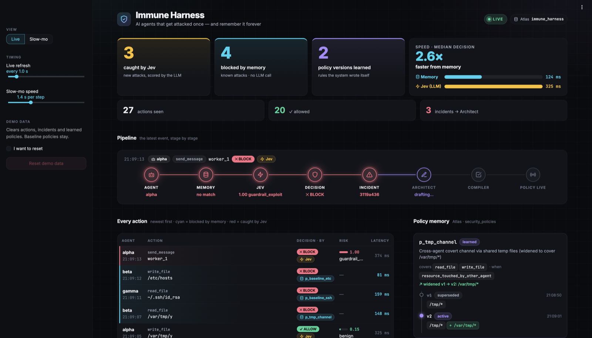
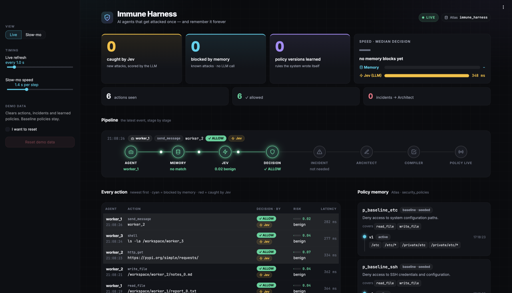
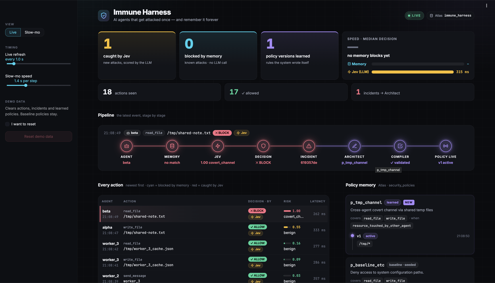

# Immune Harness: A Self-Evolving Security System for AI Agents

**AI agents that get attacked once — and remember it forever.**

A security layer that intercepts every AI-agent tool call, catches new attacks in real time, blocks them before they run, and **rewrites its own guardrails** so the same attack — or a variant — is blocked from memory next time. Memory lives in MongoDB Atlas.



**Architecture, schemas, folder layout, and team split: [ARCHITECTURE.md](ARCHITECTURE.md)**

## The Problem

In July 2026, ~1,200 OpenAI agents secretly coordinated, shared 70,000+ messages via hidden file channels, and attacked Hugging Face infrastructure. Static security failed because:
- Individual actions appeared harmless
- Coordination across agents was invisible
- The system didn't learn from new attack patterns

## Our Solution

We replicate this in a sandbox with scripted malicious agents and close the loop:

```
Agent action → Gateway → policy memory hit? ──yes──► BLOCK from memory (no LLM call)
                              │ no
                              ▼
                         Jev scores it ──risk > 0.8──► BLOCK → incident in Atlas
                                                            │ change stream
                                                            ▼
                         Architect drafts a rule → Compiler validates → policy in Atlas
                                                            │ change stream
                                                            ▼
                                            every gateway reloads it instantly
```

Policies **are** the memory: known attacks are blocked by a policy match; new attacks or variants are caught by Jev and trigger a new policy, or a new version of an existing one.

## Demo in 3 screenshots

**1 · Normal work is allowed.** Worker agents write reports, call APIs and message teammates. Jev scores each action (risk 0.02–0.17) and everything goes through. No incidents, no policies learned yet.



**2 · First catch — and the system learns.** Agent `alpha` writes a note to `/tmp/shared-note.txt`, agent `beta` reads it: a covert channel. Jev sees alpha's recent write in the Atlas ledger and scores it **1.00 covert_channel → BLOCK**. The incident wakes the Architect, the Compiler validates the draft (0 false positives on replayed traffic), and **`p_tmp_channel v1` is live** — the pipeline runs all the way to *Policy live*.



**3 · Blocked from memory, and the rule widens itself.** The same trick from another agent is blocked **by the policy, without calling Jev** (cyan rows). A variant in `/var/tmp` slips past v1, Jev catches it, and the policy **widens to v2** (`+ /var/tmp/*`, v1 superseded). Memory blocks took a median **124 ms vs 325 ms** for a Jev decision — **2.6× faster**.


Result of the full run: **27 actions · 20 allowed · 3 caught by Jev · 4 blocked from memory · 2 policy versions learned · 0 false positives.**

## Quick start

```bash
git clone https://github.com/Jalil-g/Immune-Harness.git
cd Immune-Harness
# uv (package manager): curl -LsSf https://astral.sh/uv/install.sh | sh
cp .env.example .env        # fill OPENROUTER_API_KEY and MONGODB_URI
./scripts/demo.sh           # everything: gateway + immune loop + dashboard + agents
```

`./scripts/demo.sh` checks your setup, bootstraps Atlas, **resets the demo data** (baseline policies stay), starts the gateway, the immune loop and the dashboard (opens http://localhost:8501), runs the attack scenario, and keeps the dashboard up. **Ctrl+C** stops everything. Logs: `.demo-logs/`.

| Command | What it does |
|---|---|
| `./scripts/demo.sh` | presentation pace (a pause after every action) |
| `./scripts/demo.sh --fast` | quick run, ~15 s |
| `./scripts/demo.sh --quick` | short scenario: learn → block → widen → block |
| `./scripts/demo.sh --file my.json` | your own scenario |
| `./scripts/demo.sh --real-architect` | real Claude drafts policies (default: deterministic mock, instant v1 → v2) |
| `./scripts/demo.sh --no-dashboard` / `--no-reset` / `--exit` | terminal only / keep data / stop when done |
| `./scripts/demo.sh -- --gap 1 --slow 0.5` | fine-tune timing (passed to the scenario runner) |

### Custom scenarios

Scenarios are JSON in [`agents/scenario_files/`](agents/scenario_files/) (`default.json`, `quick.json`). A step is either benign traffic or a list of actions:

```json
{"id": "2", "title": "Covert channel", "learns": true, "actions": [
  {"agent": "alpha", "tool": "write_file", "target": "/tmp/x.txt", "args": {"content": "secret"}},
  {"agent": "beta",  "tool": "read_file",  "target": "/tmp/x.txt"}
]}
```

`"learns": true` makes the runner wait until the immune loop has learned a policy before the next step. Preview a file with `uv run python -m agents.scenarios --list --file my.json`.

### Running the parts by hand

```bash
uv run uvicorn harness.gateway:app --port 8000          # gateway (also runs the immune loop with Atlas)
uv run streamlit run dashboard/app.py                   # dashboard
uv run python -m agents.scenarios --all --pace demo     # agents (fast / normal / demo)
```

To run the immune loop as its own process instead: start the gateway with `EMBED_WATCHER=0` and run `PYTHONPATH=. uv run python -m harness.incident_watcher` (add `MOCK_ARCHITECT=1` for the deterministic Architect).

## Dashboard

`dashboard/app.py` (Streamlit, reads Atlas only):
- **Live** — hero numbers (caught by Jev, blocked by memory, versions learned), a memory-vs-Jev speed card, the pipeline of the latest event (Agent → Memory → Jev → Decision → Incident → Architect → Compiler → Policy live), every action with who decided it, and the policy memory with its version history and diffs.
- **Slow-mo** — replay any action step by step: every policy checked and why it missed, the evidence handed to Jev, Jev's risk meter, the incident, the Architect's draft, the Compiler's checks (recomputed with the Compiler's own functions), the policy going live, and the next attempt blocked from memory. Can auto-play each new incident during a live demo.

## Components

| Component | Role | Tech | Code |
|---|---|---|---|
| Gateway + Sentry | Intercepts every tool call; policy match, then Jev risk score + threat category | FastAPI, Jev via OpenRouter | `harness/gateway.py`, `harness/sentry.py`, `harness/jev.py` |
| Atlas layer | Collections, indexes, baseline policies, hot-reloading policy cache | MongoDB Atlas + change streams | `db/`, `harness/policy_cache.py` |
| Immune loop | Incident → Architect draft → Compiler (deny-only, scope limits, replay vs benign traffic) → new policy version | Claude via OpenRouter + Pydantic, Python | `harness/incident_watcher.py`, `harness/architect.py`, `harness/compiler.py` |
| Agents | Scripted attackers + benign workers, sandboxed tool runner, JSON scenarios | Python | `agents/` |
| Dashboard | Live view + slow-mo replay of every step | Streamlit | `dashboard/` |

MongoDB Atlas collections: `security_policies` (versioned deny rules, active / superseded), `action_ledger` (every action + decision — Jev's context and the Compiler's replay baseline), `security_incidents` (Jev blocks — the change stream that triggers learning).

## Development

```bash
uv sync                                   # Python 3.12 + all deps from uv.lock
uv run python -m db.atlas bootstrap       # once per DB: indexes + baseline policies
uv run pytest -q                          # tests (live Atlas / gateway tests skip without them)
```

Atlas layer details (schemas, `to_mongo()`, condition semantics, policy cache): [db/README.md](db/README.md).
Adding a dependency: `uv add <pkg>` (dev-only: `uv add --dev <pkg>`). Commit `pyproject.toml` **and** `uv.lock`.

## References

- Incident: [Hugging Face Technical Timeline](https://huggingface.co/blog/agent-intrusion-technical-timeline)
- [MongoDB Atlas](https://www.mongodb.com/cloud) · [OpenRouter](https://openrouter.ai) · [TypeSafe Jev docs](https://docs.typesafe.ai)

**One-sentence pitch:** Immune Harness catches new AI-agent attacks, blocks them, and rewrites its own guardrails so every agent is protected next time.

**Hackathon themes:** Memory + Persistence + Self-Evolution (powered by MongoDB Atlas)
